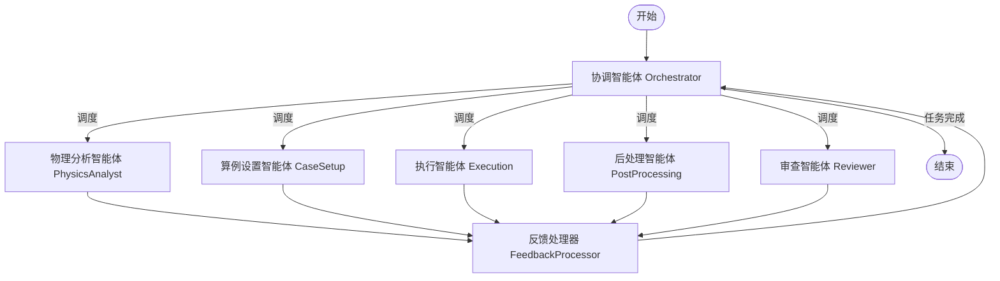

# OASiS 工作流与智能体职责说明

本文档详细说明了 `principia_ai` 项目中基于 OASiS (Open Agent System for Simulation) 架构的多智能体协作工作流及其各个智能体的职责划分。

## 1. 工作流概览

该系统采用基于图（Graph-based）的工作流管理，由 `OrchestratorAgent`（协调智能体）作为核心控制器，动态调度其他专业智能体完成 OpenFOAM 仿真任务。

### 工作流结构图

## 2. 智能体职责划分

### 2.1 协调智能体 (OrchestratorAgent)
*   **角色**: 总架构师 / 指挥官
*   **核心职责**:
    *   **任务规划**: 接收用户请求，制定高层执行计划。
    *   **动态调度**: 根据当前工作流状态（State），决定下一步激活哪个智能体。
    *   **反馈处理**: 接收其他智能体的执行结果反馈，评估任务进度，调整后续计划。
*   **工具**: 文件操作工具，知识库检索工具（用户指南、算例内容）。

### 2.2 物理分析智能体 (PhysicsAnalystAgent)
*   **角色**: 物理问题专家
*   **核心职责**:
    *   **需求分析**: 分析用户的自然语言请求，将其转化为物理仿真需求。
    *   **现状勘察**: 检查现有算例文件，理解当前物理场设置。
    *   **算例初始化**: 当目标目录为空或文件较少时，使用 `TutorialInitializer` 工具从教程库中选择最相关的算例进行初始化。
    *   **方案制定**: 结合知识库检索结果，为算例设置制定详细的物理参数和模型选择方案。
*   **工具**: 文件操作工具，知识库检索工具，算例初始化工具 (`TutorialInitializer`)。

### 2.3 算例设置智能体 (CaseSetupAgent)
*   **角色**: 配置执行专家
*   **核心职责**:
    *   **文件操作**: 负责所有 OpenFOAM 算例文件的生成、修改和配置（如 `0/` 文件夹下的边界条件，`constant/` 下的物理属性，`system/` 下的控制参数）。
    *   **方案落地**: 执行物理分析智能体制定的修改方案。
*   **工具**: 文件操作工具，知识库检索工具。

### 2.4 执行智能体 (ExecutionAgent)
*   **角色**: 仿真运行员
*   **核心职责**:
    *   **脚本编写与执行**: 编写 `Allrun` 和 `Allclean` 文件，来运行各项指令和生成日志文件。
    *   **日志分析与决策**: 简单分析日志文件的内容，判断后续行动：
        *   **自行修正**: 若判断只需要更新 `Allrun` 文件，则自行修改并重新运行。
        *   **反馈上报**: 若判断需要更新修改配置文件，则反馈给 `Orchestrator`。
*   **工具**: 文件操作工具，知识库检索工具。

### 2.5 后处理智能体 (PostProcessingAgent)
*   **角色**: 结果分析师
*   **核心职责**:
    *   **数据提取**: 从计算结果中提取关键数据（如压力峰值、速度场等）。
    *   **结果可视化**: 生成图表或云图。
    *   **报告生成**: 总结仿真结果，回答用户最初的问题。
*   **工具**: 文件操作工具，知识库检索工具。

### 2.6 审查智能体 (ReviewerAgent)
*   **角色**: 质量保证 (QA)
*   **核心职责**:
    *   **结果审查**: 检查各个阶段的输出是否符合预期和规范。
    *   **错误排查**: 在任务失败或结果异常时进行诊断。
*   **工具**: 知识库检索工具。

## 3. 协作机制

1.  **中心化路由**: 所有智能体执行完毕后，都会将结果传递给 `FeedbackProcessor`，最终汇总回 `Orchestrator`。这意味着智能体之间不直接通信，而是通过协调者进行信息交换。
2.  **状态共享**: 所有智能体共享一个全局图状态 (`GraphState`)，其中包含了用户请求、当前算例路径、任务历史、计划列表等信息。
3.  **知识增强**: 大多数智能体都配备了知识库检索工具 (`UserGuideKnowledgeGraphRetriever`, `CaseContentKnowledgeGraphRetriever`)，能够在决策和执行过程中查询 BlastFoam 的官方文档和参考算例。
