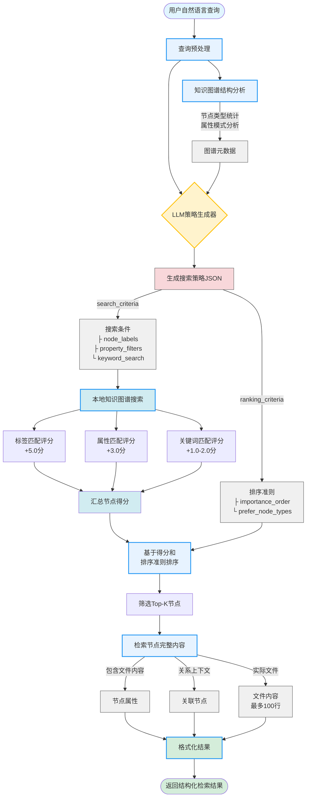

# 基于LLM生成搜索策略的知识图谱检索方法

## PPT内容整理

---

## 📌 核心思想

**动态搜索策略生成**：利用大语言模型（LLM）理解用户查询意图，自动生成针对知识图谱结构的精确搜索策略，实现智能化、自适应的知识检索。

---

## 🎯 方法特点

### 1. **智能查询理解**
- LLM分析自然语言查询的语义和意图
- 自动识别查询所涉及的实体类型（案例、文件、变量、求解器等）
- 提取关键概念和约束条件

### 2. **结构化搜索策略**
- **节点标签过滤**：识别目标节点类型（Case、File、Variable、Solver等）
- **属性过滤器**：生成精确的属性匹配条件（支持通配符）
- **关键词搜索**：提取重要关键词在节点属性中进行匹配
- **排序准则**：定义属性重要性顺序和优先节点类型

### 3. **分层检索策略**
- **层级化搜索**：从章节→小节→子节点逐级精准定位
- **上下文感知**：基于知识图谱结构动态调整搜索范围
- **多维度评分**：综合节点标签、属性匹配度、关键词相关性

---

## 🔧 技术架构

### 核心组件

1. **知识图谱结构分析器**
   - 统计节点类型分布（Case、File、Variable等）
   - 分析节点属性模式
   - 提供图谱元数据概览

2. **LLM策略生成器**
   - 输入：用户查询 + 知识图谱结构摘要
   - 输出：结构化JSON搜索策略
   - 包含：搜索条件、排序规则、策略说明

3. **本地搜索执行器**
   - 根据生成的策略在本地知识图谱中执行搜索
   - 多维度评分机制（标签匹配+5分、属性匹配+3分、关键词+1-2分）
   - 高效的内存检索（无需外部数据库）

4. **结果排序与内容检索**
   - 基于评分和策略偏好排序
   - 检索Top-K节点的完整内容
   - 包含文件内容和关系上下文

---

## 📊 性能表现

### 与传统嵌入式检索对比（在BlastFOAM数据集上）

| 指标 | 嵌入检索 | **知识图谱检索** | 提升 |
|------|---------|--------------|------|
| MRR | 0.2294 | **0.5292** | +130.7% |
| Hit@1 | 0.1667 | **0.4500** | +169.9% |
| Hit@5 | 0.3333 | **0.6083** | +82.5% |
| Precision@5 | 0.1433 | **0.4583** | +219.8% |
| Recall@5 | 0.3208 | **0.5958** | +85.7% |

### 不同难度级别表现

- **基础查询**: MRR 0.6429, Hit@5 65.71%
- **中等查询**: MRR 0.4605, Hit@5 55.26%
- **高级查询**: MRR 0.5000, Hit@5 61.70%

**关键发现**：知识图谱检索在所有难度级别上均显著优于嵌入检索，尤其在高级复杂查询中表现突出。

---

## 🌟 技术优势

1. **可解释性强**
   - 搜索策略可视化
   - 明确的匹配逻辑
   - 便于调试和优化

2. **结构化知识利用**
   - 充分利用知识图谱的关系和层次结构
   - 超越简单的语义相似度匹配

3. **自适应能力**
   - 针对不同查询类型自动调整策略
   - 无需手工规则设计

4. **高检索精度**
   - 在复杂技术领域（CFD仿真）达到60%+ Hit@5
   - 相比传统方法提升超过80%

---

## 💡 应用场景

- **技术文档检索**：OpenFOAM/BlastFOAM用户手册和教程检索
- **代码示例查找**：基于需求自动定位相关案例文件
- **参数配置推荐**：查找特定物理模型的配置参数
- **最佳实践发现**：检索类似场景的完整案例

---

## 🚀 未来拓展

1. **多模态融合**：结合嵌入检索和图谱检索的混合策略
2. **交互式优化**：基于用户反馈动态调整搜索策略
3. **领域迁移**：应用到其他技术文档和知识库
4. **实时学习**：根据检索反馈持续优化策略生成

---

## 📚 参考实现

- **用户手册检索**：`principia_ai/tools/user_guide_knowledge_graph_tool.py`
- **案例内容检索**：`principia_ai/tools/case_content_knowledge_graph_tool.py`
- **评估脚本**：`experiments/evaluate_knowledge_graph_retriever.py`

---

## Mermaid流程图



---

## 搜索策略示例

### 示例查询
**Query**: "What turbulence model is used in the blastFoam_axisymmetricCharge case?"

### LLM生成的策略
```json
{
  "search_criteria": {
    "node_labels": ["Case", "File", "Variable"],
    "property_filters": {
      "name": "*turbulence*",
      "path": "*blastFoam_axisymmetricCharge*"
    },
    "keyword_search": ["turbulence", "model", "axisymmetricCharge"]
  },
  "ranking_criteria": {
    "importance_order": ["name", "type", "path"],
    "prefer_node_types": ["File", "Variable"]
  },
  "explanation": "Search for turbulence-related files and variables in the specified case"
}
```

### 执行过程
1. **标签匹配**：筛选Case、File、Variable类型节点
2. **属性过滤**：匹配含"turbulence"的name和含案例名的path
3. **关键词评分**：在所有属性中搜索关键词
4. **综合排序**：File和Variable节点优先，按name→type→path重要性排序
5. **返回Top-5**：最相关的节点及其文件内容

---

## 总结

基于LLM生成搜索策略的知识图谱检索方法通过将**自然语言理解**与**结构化知识检索**深度融合，实现了：

✅ **高精度**：相比传统方法提升80%+  
✅ **强可解释性**：明确的搜索逻辑  
✅ **自适应能力**：针对查询自动优化策略  
✅ **领域知识整合**：充分利用图谱结构信息  

在技术文档检索、专家系统构建等场景中具有广阔应用前景。
